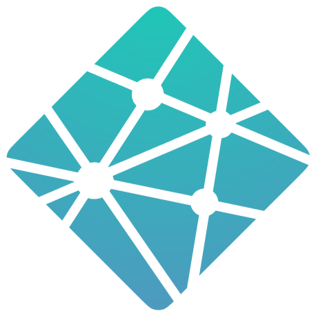

<h3 align="center">Proyecto N4</h3>
<h1 align="center">Avantflix</h1>

  

     

<h3 align="center">Plataforma diseñada con ReactJS</h3>

  

## ⚛️ Descripción

Este desafío, que forma parte integral del programa ONE, tiene como objetivo principal el desarrollo del "Aluraflix", una plataforma diseñada para categorizar, registrar, eliminar y actualizar vídeos.

## 🌐 Funcionalidad

Esta aplicación consiste en registrar, eliminar, actualizar y listar videos.
Cada video se puede eliminar individualmente y editar cada una de las opciones registradas.

## 🪐 Vista previa de mi proyecto: Avantflix

json-server ➘
Simulación de una api rest utilizando **Node js**

## 🌌 Agregando videos: en funcionamiento

---

##  Link del proyecto en NETLIFY

 [Avantflix open App](https://avantflix-n4.netlify.app/)

---

### 🛠 Tecnologías utilizadas 🛠

HTML, CSS y JavaScript.

# ╰┈➤ Author

**<h2 align="center"> ❀ ˖ ⋆  ݁ ‎  ݁‎[AvantNyx](https://github.com/AvantNyx)  ݁ ⋆ ˖ ❀</h2>**
